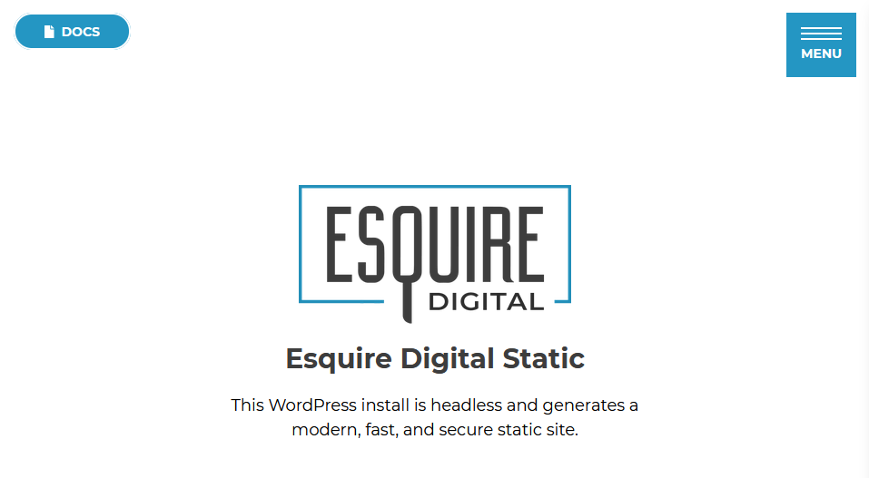
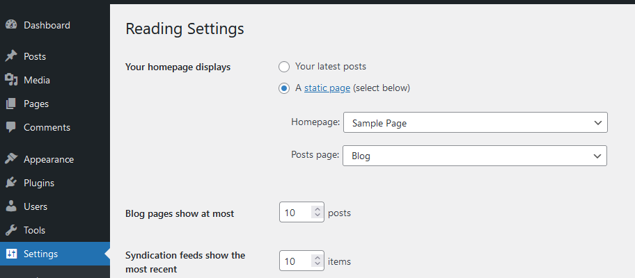
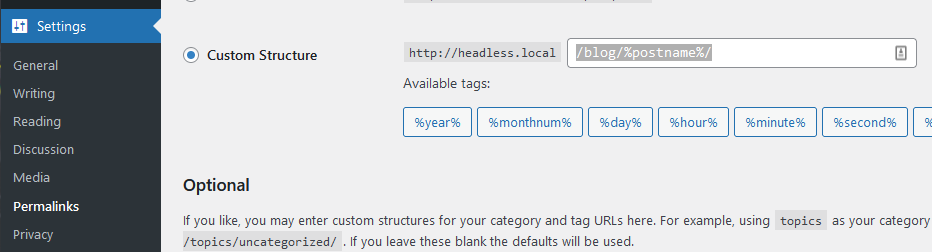
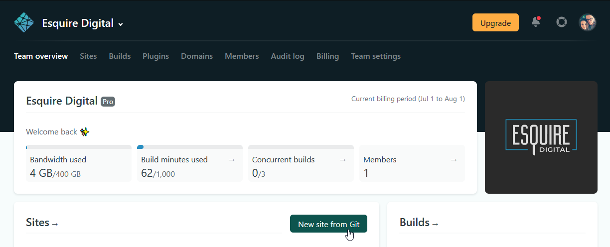

## WordPress Setup

To begin, you will need to create a **publicly available** WordPress installation. Using Kinsta, Forge, WPengine, or another solution, create a new normal WordPress instance and proceed with its setup as you would normally. Once you have a WordPress dashboard up and running, continue with the required setup below.

### Plugins

These plugins are _required_ for EDS to function and must be installed:

- <input type="checkbox"> **ACF Pro** adds custom fields to make content editing much easier. You must install this directly from the zip archive.
- <input type="checkbox"> <a href="https://wordpress.org/plugins/wordpress-seo/">YoastSEO</a> adds valuable SEO editors and generation
- <input type="checkbox"> <a href="https://wordpress.org/plugins/wp-gatsby/">WPGatsby</a> adds core functionality for Gatsby
- <input type="checkbox"> <a href="https://wordpress.org/plugins/wp-jamstack-deployments/">JAMstack Deployments</a> adds support for triggering Netlify builds
- <input type="checkbox"> <a href="https://wordpress.org/plugins/headless-mode/">Headless Mode</a> automatically redirects non-authenticated users to the front-end. Essential to prevent crawlers from crawling the WordPress front-end.
- <input type="checkbox"> <a href="https://wordpress.org/plugins/wp-graphql/">WPGraphQL</a> allows EDS to query data through GraphQL
- <input type="checkbox"> <a href="https://wordpress.org/plugins/add-wpgraphql-seo/">WPGraphQL Yoast SEO Addon</a> adds Yoast SEO data to GraphQL
- <input type="checkbox"> <a href="https://www.wpgraphql.com/acf/">WPGraphQL for Advanced Custom Fields</a> adds custom fields to GraphQL schema

Install and enable all plugins in the above list. JAMstack deployments and Headless Mode require some configuration, but this will be covered later when we setup Netlify.

### Theme

Editors should be able to navigate the WordPress front-end as they normally do to make editing pages easier. Install the theme specially made for editors and developers to work with static sites by downloading the most recent [release](https://github.com/Esquire-Digital/static-backend/releases) archive called `esquire-static.zip`. Upload the theme zip through WordPress's theme installer, or unzip the archive in the `wp-content/themes` folder. Enable the theme, and if everything was done correctly, you should be greeted with the splash page on the WordPress front-end.



While you downloaded the zip release and uploaded it to WordPress, you should still clone the repository to work with locally. You will have to change some files to create field groups specific to this site. Clone it to your desired directory:

```sh
git clone https://github.com/Esquire-Digital/static-backend.git
```

With this local repository you will make changes to some files and push them to the theme's folder using FTP. For example, if you change `library/admin.php`, you would copy this file over FTP to `wp-content/themes/esquire-static/library/admin.php`. Note that there are many files included in the clone that shouldn't be copied over, such as `.gitignore`, `package.json` and many others.

### Home Page & Permalinks

The home page and blog page need to be set to static pages in WordPress. Create two pages called `Home` and `Blog`. Once created, navigate to `Settings > Reading` and set the homepages to display these two static pages:



The permalinks structure, by default, will not include `/blog/` in links for blog posts. To fix this, navigate to `Settings > Permalinks`. Select Custom Structure from the common settings section, and set the value to `/blog/%postname%/`:



## Front End Setup

By now, you have a working WordPress install that is ready to become headless. Great! Now it's time to set up the Gatsby environment, which will be how you develop the front end. Start by cloning the [EDS repository](https://github.com/Esquire-Digital/static) into your desired directory:

```sh
git clone https://github.com/Esquire-Digital/static.git [client short name]
```

Once cloned, you will need to replace a few placeholder values with real values. There is a constants file that contains information used throughout EDS to perform tasks. Edit `util/constants.js` and fill out the placeholders with their respective values:

```js
module.exports = {
  hostname: "https://www.esquiredigital.com",
  wordpressUrl: "https://edit.esquiredigital.com",
  cloudinaryURL:
    "https://res.cloudinary.com/nextlevel/image/fetch/f_auto,q_auto/",
  gtmCode: "GTM-NBH6CFM",
};
```

Some of these cannot be filled out until you have finished the setup. Remember to change `hostname` to the current URL of the live site, and `gtmCode` to the GTM code when you have it. You will also need to change the redirect in the `static/_redirects` file to reflect the same [WORDPRESS_URL] you entered in the constants file:

```txt
/wp-admin https://edit.esquiredigital.com/wp-admin 301
```

Once done, EDS is ready to go! Simply install dependencies, and start the environment:

```sh
npm install
npm start
```

You should see Gatsby generating pages and content without errors. Gatsby can have _very_ ambiguous errors if you did not set up the WordPress URL correctly. See [common errors](#) if you run into one.

Lastly, you should install the included Esquire CLI to make your life easier:

```sh
npm link
```

This will allow you to use the command `esquire` in your terminal to help create commonly repeated code.

## Git Setup

Now it's time to create the GitHub repositories to save your code and handle automatic deployments. By this time, you should have _two_ code bases. You have the WordPress theme that goes onto WordPress, and you have the front end code that generates pages. Both of these have to be pushed to separate GitHub repositories to make sure we are always saving the code we put into production.

Under the [Esquire Digital organization](https://github.com/Esquire-Digital), create two new **private** repositories. Do not initialize README, license or .gitignore files because you will be pushing existing code with these files included. You can leave the description empty, but the name should follow our naming convention:

- `[CLIENT SHORT NAME]-frontend`: The front end code you cloned and edited from Esquire Digital Static. For example, if this client's name was Goodrich and Geist, a proper name would be `goodrich-frontend`.
- `[CLIENT SHORT NAME]-backend`: The WordPress theme that gets installed on the WordPress site. This must be saved because you will write code that creates custom fields specific to the client's site. Following the same example, a proper name would be `goodrich-backend`.

Once these are created, you should push the code you have (even if it is not changed). Navigate to your WordPress theme directory, which was cloned in the [theme setup](http://localhost:3000/#/development/getting-started?id=theme) step. Now, retrieve the GitHub repository's URL (clicking the Code button and copying the URL). From inside the directory, change your remote repository to the one you just created, and push any changes:

```sh
git add .
git commit -m "Initial commit"
git remote remove origin
git remote add origin <GIT URL>
git push -u origin main
```

Similarly, you will have to push the code you have edited from when you cloned the front end code. Copy the front end repository's URL and navigate to the codebase's directory. Once inside, run the same set of commands to push your code:

```sh
git add .
git commit -m "Initial commit"
git remote remove origin
git remote add origin <GIT URL>
git push -u origin main
```

## Netlify Setup (optional)

Now that everything is on GitHub you can publish the site to Netlify. This will allow people to view the site in production every time you push to the `main` branch of the front end. While optional, it's highly recommended to get this step out of the way, and use the power of continuous integration to see your changes reflected each push.

To publish the site to Netlify, log into the Netlify dashboard using the credentials in LastPass. Once in, navigate to the Esquire Digital team, and click the `New site from Git` button.



Select `GitHub` from the Continuous Deployment section. Click your username to open the drop down menu and select Esquire-Digital from the options. Now find the front end repository you just created. The default settings are perfectly fine. Once created, Netlify will assign a random name to the site. To change this, click the site in the list and navigate to `Site settings`. Here, you can press the `Change site name` button to change the site name to something more reasonable. Use the same client short name from when you created the repositories. Netlify will then change the domain to be `[CLIENT SHORT NAME].netlify.app`.

That's it! Now every time you push to the `main` branch, it will be built and published to production. Sometimes you do not want the in progress site to be accidentally crawled by Google. If this is the case, add a `static/_headers` file in the front end code with the contents:

```txt
https://example.netlify.app/*
   X-Robots-Tag: noindex
```

This will instruct crawlers to not index any pages, even if they accidentally find the URL somehow. Push this file to the `main` branch, and Netlify will know to return the X-Robots-Tag header in each request.
