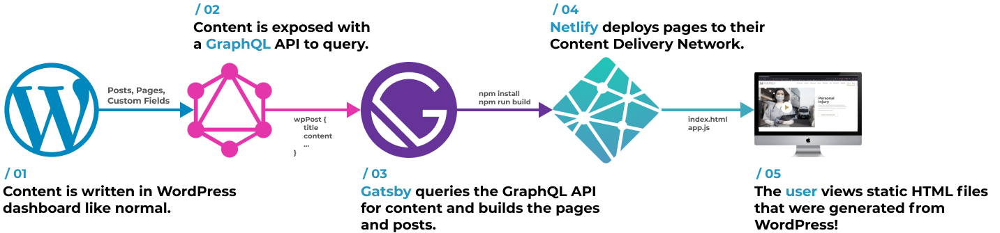

## Background Knowledge

This documentation only explains the novelty of building sites using Esquire Digital Static, and assumes you are comfortable with topics:

- [Cascading Style Sheets](https://developer.mozilla.org/en-US/docs/Web/CSS) (CSS)
- [HyperText Markup Language](https://developer.mozilla.org/en-US/docs/Web/HTML) (HTML)
- [JavaScript](https://developer.mozilla.org/en-US/docs/Web/JavaScript) (JS)
- [React](https://reactjs.org/tutorial/tutorial.html)
- [Node.js](https://nodejs.org/en/about/) and [npm](https://docs.npmjs.com/about-npm)
- [Basic HTTP](https://developer.mozilla.org/en-US/docs/Web/HTTP/Overview) (how resources are transferred when loading a page and basic HTTP requests)
- WordPress development

You also must be at least familiar with these topics as well:

- [GraphQL](https://graphql.org/learn/) Query Language

## Headless Architecture

As mentioned in the [how it works](../how-it-works.md) section, Esquire Digital Static uses a headless WordPress instance. While it may sound special, the headless WordPress instance is actually just a normal WordPress install. This WordPress install has a set of plugins that enable us to extract the information we need on the front end, and has a theme that displays no content. Basically, we modify a regular WordPress instance to only manage content and nothing more.

Below is a thousand foot perspective of how the entire system works; from editing content, to generating pages, to publishing them to the internet.

### WordPress

The WordPress install maintains a database of content that editors can edit and publish as they need. By using a plugin called WPGraphQL, we expose this content for easy querying.
