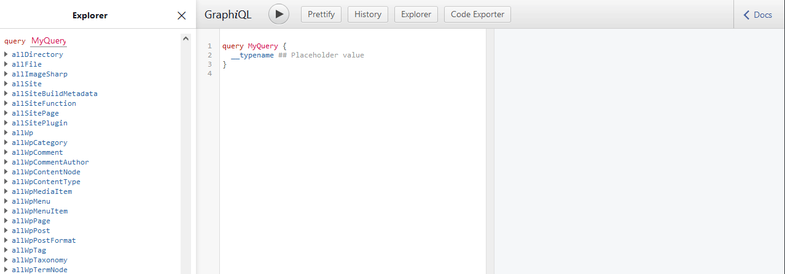
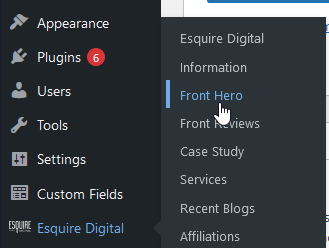
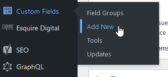
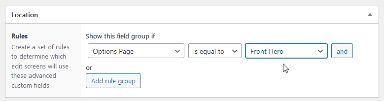
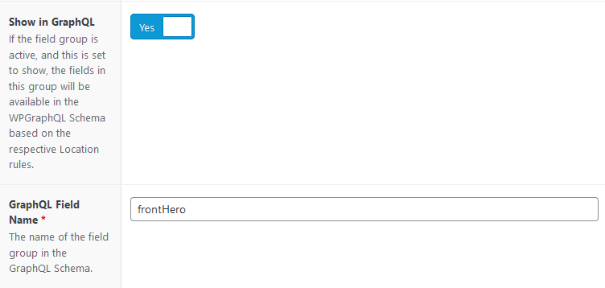

## GraphQL

We query all data through a GraphQL API, which exposes the information we need about pages, custom fields and posts. If you are not familiar with GraphQL, it's best to watch a refresher video first like [this one](https://www.youtube.com/watch?v=Y0lDGjwRYKw). To see exactly what data you have access to and craft queries, you can use the GraphiQL explorer. Start the development environment with `npm start`, and navigate to `localhost:8000/__graphql` to open up the GraphiQL explorer.



Here, you can visually build queries by selecting the data you want to query from the left. You can also apply filters, limits and all sorts of transformations in the explorer. By the nature of GraphQL, most data is aptly named and are self-explanatory. `allWpPage` will query all pages, while `allWpPost` will query posts, etc.

The queries that you create in GraphiQL can be directly copied into the static queries and page queries you run in components.

## Custom Fields

Custom Fields can become a little tricky to add to the GraphQL schema. Afterall, GraphQL needs to know about our fields in order to expose them to be queried.

### Options Pages

Adding more options pages require some changes to the WordPress theme we cloned during the setup. Open your local WordPress theme directory (should be named `[CLIENT SHORTNAME]-backend`). Now, edit `library/admin.php` to add your new options sub page:

```js
<?php

if (class_exists('ACF')) {

  if (function_exists('acf_add_options_page')) {
    $esquire = acf_add_options_page(array(
      'page_title' => 'Esquire Digital',
      'menu_title' => 'Esquire Digital',
      'menu_slug' => 'esquire_acf',
      'capability' => 'edit_posts',
      'icon_url' => nextlevel_get_asset("images/icon.png"),
      'redirect' => false,
      'show_in_graphql' => true,
      'graphql_single_name' => 'esquire',
      'graphql_plural_name' => 'esquire',
    ));

    // Adding a new sub page called "Front Hero":
    acf_add_options_sub_page(array(
      'page_title' => 'Front Hero',
      'menu_title' => 'Front Hero',
      'parent_slug' => $esquire['menu_slug'],
      'show_in_graphql' => true, // This must be true, or else you will not be able to query it.
    ));
  }
  // continued...
}
```

You can now copy this file over FTP to the WordPress theme directory, overwriting `library/admin.php` with your new one. This will create a new subpage to the Esquire options page in the WordPress dashboard:



You can add custom fields to this as you would normally. Create a new field group:



Name it whatever you want, and add whatever fields you would like to have. You can query all current field types. Once done, set the location rule to show if the options page is equal to your newly created options page:



Now, check **Show in GraphQL**, and give it a name as it would appear in the schema. GraphQL schema is camelcase, so using the camelcase version of the field group's name is best:



Done! Now if you fill the fields and restart your development environment, you should be able to query the options page under `wp`:

```graphql
query {
  wp {
    # Name of the options page:
    frontHero {
      # Name of the field group (happens to match options page):
      frontHero {
        # Fields you added to the field group:
        title
        button {
          url
          title
        }
      }
    }
  }
}
```

### Regular Fields

Querying regular fields works the same way. GraphQL will intelligently place your fields on the schema you're querying. For instance, if you make a `Settings` field group that appears on pages, when you are querying pages you could query that field group:

```graphql
query {
  wpPage(id: $id) {
    settings {
      # fields...
    }
  }
}
```

GraphQL cannot, however, parse logic. For instance, you cannot query a field group that is set to show only on a certain page template. You can only set it to show on posts, pages or options pages.

## Menus

GraphQL needs to know what menus you want to query, and does this by checking the menu locations added by the theme. To add a new menu, for example a `Spanish Menu`, locate your local WordPress theme directory. Edit the function `nextlevel_menus` in `library/setup.php` to reflect your new menu location:

```js
function nextlevel_menus()
{
  register_nav_menus(
    array(
      'main-menu' => __('Main Menu'),
      'sidebar-menu' => __('Sidebar Menu'),
      'location-menu' => __('Location Menu'),
      'spanish-menu' => __('Spanish Menu') // A new location for a spanish menu
    )
  );
}
```

Upload this file over FTP and overwrite the already existing `setup.php` file in the WordPress theme. Now you can add a menu in the WordPress dashboard and set its location to `Spanish Menu`.

Gatsby heavily caches menues, because they take a long time to parse and query. To see your new changes, stop the development environment if it is running, and run:

```sh
npm run clean
npm start
```

This will destroy the Gatsby cache and re-query menus. You should now be able to query your menu:

```graphql
{
  query {
    wpMenu(locations: { eq: SPANISH_MENU }) {
      menuItems {
        nodes {
          path
          label
          id
          parentId
        }
      }
    }
  }
}
```

## Posts and Pages

Posts and pages have the querying done out of the box. The query is done in the `pageQuery` export:

```js
export const pageQuery = graphql`
  query ($id: String!) {
    wpPage(id: { eq: $id }) {
      title
      ...SEO
    }
  }
`;
```

Breaking this down, Gatsby scans all page files for an export called `pageQuery`. When creating a page using this file, it will pass the ID of the page to the query. That's why the query is accepting a parameter, `$id` that must be the type `String`. The query then finds the page that has an id equal to the page's id passed by Gatsby. This is how Gatsby builds pages; it passes the page query the page's ID, so that you can query that page's data.

Often, you'll want the content of the page or even some custom fields. To do that, just add to the page query like any normal query:

```js
export const pageQuery = graphql`
  query ($id: String!) {
    wpPage(id: { eq: $id }) {
      title
      content
      fieldGroup {
        fieldName
      }
      ...SEO
    }
  }
`;
```

Posts are no different to Gatsby and behave the same. To Gatsby, you are simply building another page, it being a post has no distinction. The only difference is the pageQuery will find the `wpPost` with a matching id, instead of the `wpPage`:

```js
export const pageQuery = graphql`
  query ($id: String!) {
    wpPost(id: { eq: $id }) {
      title
      content
      fieldGroup {
        fieldName
      }
      ...PostSEO
    }
  }
`;
```

This is because WordPress differentiates posts from pages, and so GraphQL must also.
