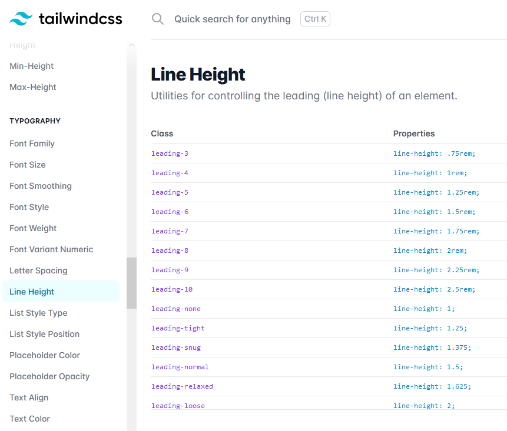

## twin.macro

If you're not familiar with styled components and tailwind, the way we style components may seem alien. Once you become comfortable with the syntax, you will learn to love the flexibility CS in JS provides, and the easy shortcuts twin.macro provide.

twin.macro is an excellent package that allows us to use [tailwindcss](https://tailwindcss.com/docs) with styled components. If you are not familiar with tailwind, it is a way to write _lots_ of CSS with minimal lines of code. For a lot of components, styling can take just one line! Tailwind translates CSS rules into simple class names. For example, to get `border-radius: 50%;`, you would write `rounded-full`. If I just wanted a simple styled heading, here is the difference in code length:

```js
import tw, { styled } from "twin.macro";

// Without tailwind
const Title = styled.h1`
  line-height: 1.25;
  font-weight: 700;
  font-family: Montserrat, sans-serif;
  color: var(--primary);
`;

// With tailwind (one line!)
const Title2 = tw.hw`leading-tight font-bold font-mont text-primary`;
```

As you can see, for more complicated style sheets this can condense the lines of code by a lot. Once you become familiar with tailwind, remembering how CSS rules map to tailwind classes becomes easy. However, tailwind has excellent [docs](https://tailwindcss.com/docs) with a search bar. You can simply search the name of the CSS rule you want to use, and get the tailwind classes for that rule:



This brings us to what twin.macro actually is, and how to use it. It's highly recommended you read the full [documentation](https://github.com/ben-rogerson/twin.macro) to get a complete explanation on what twin is by its creator.

However, you'll mainly use these three imports, as seen in the partials generated by the CLI:

```js
import tw, { styled, css } from "twin.macro";
```

## tw

`tw` is used to define components styled only with tailwind. For example:

```js
const Title = tw.h1`leading-tight font-bold font-mont text-primary`; // This is correct
const Title2 = tw.h1`line-height: 1.25;`; // This will error
```

Simple! You can replace `h1` with the type of HTML element you want to style. If you wanted to create a styled button, you would use `tw.button`.

## styled

`styled` is used to create styled components that use tailwind and regular CSS rules. You sometimes need to use CSS rules that aren't supported by tailwind or are too specific. For example:

```js
const Menu = styled.div`
  ${tw`flex flex-col items-center justify-center bg-white px-8`}
  z-index: 9999;
`;
```

Great! We can use tailwind and regular CSS rules together now. But notice that we can literally do anything with the flexibility this provides; we can use actual logic in our CSS!

```js
const random = Math.random();
const RandomTitle = styled.h1`
  ${tw`text-3xl font-mont font-bold`}
  color: ${random < 0.5 ? "red" : "blue"}
`;
```

While somewhat contrived, this example shows we can use actual Javascript logic in our CSS code. Taking this a step further, the styled components we create can take props. This is also where our `css` import comes in:

```js
const Title = styled.h1(({ large, rotate }) => [
  tw`text-3xl font-bold font-mont text-primary`, // Base tailwind styles
  large && tw`text-4xl`, // If large is passed as a prop, make it larger!
  rotate > 0 &&
    css`
      transform: rotate(${rotate}deg);
    `, // If rotate is passed as a prop, rotate it!
]);
```

Now, we are defining a styled component (that is an H1) that takes two props. The parameter passed to the `styled.h1` function is an arrow function that returns an array of `tw` and `css` objects, containing tailwindcss and css rules respectively. Using ternary operators, you can add on styles depending on the props that are passed into the component. So, bringing it all together, in some other file:

```js
const Component = () => {
    return(
        <Title>I am normal.</Title>
        <Title large>I am BIG!</Title>
        <Title rotate={180}>I am flipped!</Title>
        <Title rotate={360}>I am normal too =(</Title>
    )
}
```

## Styling Existing Components

Often, you'll want to expand on an already existing component. You can do this, both with `tw` and `styled`. For example:

```js
const Button = tw.button`bg-primary text-white font-bold font-mont text-left hover:bg-hover`;

const RedButton = tw(Button)`bg-red-500`;

const BlueButton = styled(Button)`
  ${tw`shadow-lg`}
  background-color: blue;
`;

const BlueOrRedButton = styled(Button)(({red}) => [
    tw`bg-blue-500`
    red && tw`bg-red-500`
])
```

## Custom Tailwind Classes

Tailwind is especially amazing because you can create your own classes and use them in tailwind. To do this, edit `tailwind.config.js`. Under `theme` and `extend`, you can set your own classes with whatever values you want. There are some custom classes added by default, to make your life easier. It is wise to change `primary` to the actual primary color of your site, and add any frequently used colors. You can even nest classes!

```js
module.exports = {
  prefix: "",
  purge: false,
  important: false,
  separator: ":",
  theme: {
    extend: {
      colors: {
        primary: "#2496c3",
        secondary: "#eeeeee",
        form: {
          error: "#bf2200", // Can be accessed via form-error (e.g: text-form-error)
          success: "#00e754"
        }
      },
      fontFamily: {
        mont: ["Montserrat", "sans-serif"],
        lora: ["Lora", "serif"] // New font! Falls back to serif.
      },
    },
    ...
  }
  ...
}
```

## Adding Fonts

To add more Google fonts, edit the plugins array in `gatsby-config.js` to include the family and variants you need under `gatsby-plugin-webfonts`:

```js
{
  resolve: `gatsby-plugin-webfonts`,
  options: {
    fonts: {
      google: [
        {
          family: 'Montserrat',
          variants: ['400', '700'],
        },
        {
          family: 'Lora',
          variants: ['400', '400i', '600', '700', '700i'], // Include italic variants and semi-bold (600)
        },
      ],
    },
  },
}
```

This will automatically include a link to the stylesheet for the font face, and set it to swap text on load.
